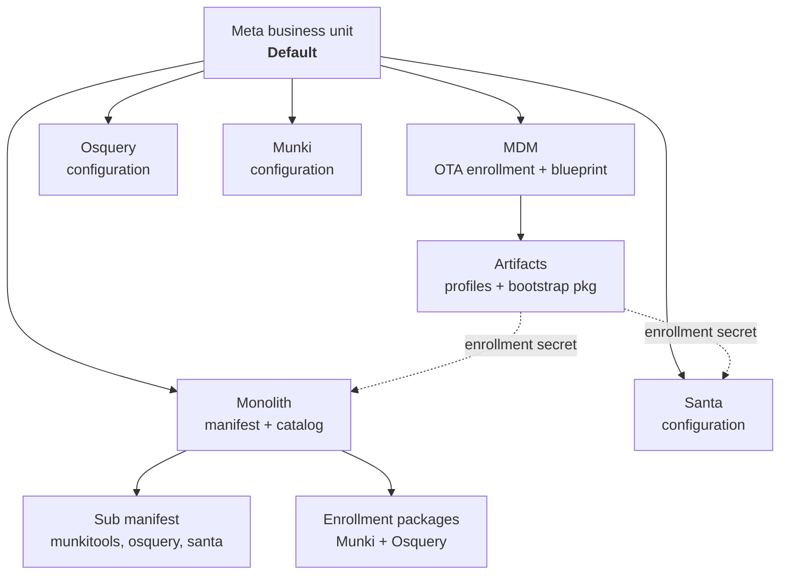

# Zentral Cloud — Terraform Starter Kit

The Terraform / OpenTofu configuration used to pre-configure tenants in Zentral Cloud.

Apply it against a fresh tenant and you get a complete, opinionated macOS management baseline in one `apply`: MDM enrollment and blueprint, a Munki repository manifest, and the Santa and Osquery agents — all wired to a single business unit, with the enrollment secrets flowing automatically from one component into the next.

It is also meant to be read. Every resource here is a working example of the [Zentral Terraform provider](https://registry.terraform.io/providers/zentralopensource/zentral/latest/docs), so the repository doubles as a starting point for your own configuration: fork it, change the parts that are specific to your fleet, and keep going.

---

## What is Zentral?

[Zentral](https://github.com/zentralopensource/zentral) is an open source platform for managing and monitoring Apple endpoints. It combines:

- **Inventory** — a consolidated view of your machines, fed by MDM, Munki, Osquery and third-party sources.
- **Apple MDM** — a full MDM server: DEP/ADE, OTA and user enrollments, declarative device management, profiles, apps, FileVault escrow, recovery passwords, software update enforcement.
- **Agent management** — first-class configuration and enrollment for [Munki](https://www.munki.org/), [Osquery](https://osquery.io/) and [Santa](https://northpole.dev/).
- **Monolith** — a Munki repository server that turns catalogs and manifests into a managed, per-business-unit distribution point.
- **Event pipeline** — every check-in, install, execution and MDM command becomes an event that can be shipped to your SIEM or data warehouse.

Everything in the Zentral web UI is backed by a REST API, and the Terraform provider is a thin, typed layer on top of that API. That means your fleet configuration can live in Git, be reviewed in pull requests, and roll out the same way the rest of your infrastructure does.

- Zentral (server, API, docs): <https://github.com/zentralopensource/zentral>
- Terraform provider (resource reference): <https://registry.terraform.io/providers/zentralopensource/zentral/latest/docs>
- Provider source: <https://github.com/zentralopensource/terraform-provider-zentral>

## What this configuration builds



The device flow that comes out of it:

1. A Mac enrolls into MDM (OTA enrollment, or ADE using the same blueprint) and receives the **Default** blueprint.
2. During Setup Assistant the blueprint installs the *Monolith — Default enrollment* profile, then the **bootstrap package** — which depends on that profile, so Munki can immediately reach the tenant's repository.
3. Munki installs the required agents from the *Required agents* sub manifest: `munkitools`, `osquery`, `santa`.
4. The MDM profiles that were already delivered grant those agents what they need — TCC/Full Disk Access, the Santa system extension policy and notification settings, managed login items, private-data logging — and the Santa configuration profile carries the Santa enrollment secret.
5. The machine reports into inventory from four directions at once: MDM, Munki, Osquery and Santa.

### Resource inventory

| File | What it configures |
| --- | --- |
| [provider.tf](provider.tf) | Provider requirement, backend placeholder, API base URL and token |
| [variables.tf](variables.tf) | `fqdn` and `api_token` inputs |
| [meta_business_units.tf](meta_business_units.tf) | The `Default` meta business unit everything else hangs off |
| [mdm_ota_enrollment.tf](mdm_ota_enrollment.tf) | OTA enrollment, bound to the tenant's push certificate and SCEP issuer |
| [mdm_default_blueprint.tf](mdm_default_blueprint.tf) | Blueprint, FileVault escrow, recovery passwords, software update enforcement, blueprint↔artifact links |
| [mdm_artifacts.tf](mdm_artifacts.tf) | MDM artifacts: configuration profiles and the bootstrap package |
| [monolith_manifests.tf](monolith_manifests.tf) | Munki manifest, catalog, enrollment and enrollment packages |
| [monolith_agents_sub_manifest.tf](monolith_agents_sub_manifest.tf) | The *Required agents* sub manifest |
| [munki_configurations.tf](munki_configurations.tf) | Munki configuration and enrollment |
| [osquery_configurations.tf](osquery_configurations.tf) | Osquery configuration, enrollment, and the Munki application-usage ATC |
| [santa_configurations.tf](santa_configurations.tf) | Santa configuration in `MONITOR` mode, plus baseline rules |
| [mobileconfigs/](mobileconfigs) | The `.mobileconfig` payloads referenced by the MDM artifacts |

Two of the `.mobileconfig` files are Terraform templates rather than static files — `monolith.default-enrollment.v1.mobileconfig` and `santa.default-configuration.v1.mobileconfig` are rendered with `templatefile()` so the tenant FQDN and the enrollment secret generated by Zentral are injected at apply time. You never copy a secret by hand.

## Prerequisites

- Terraform ≥ 1.0 or [OpenTofu](https://opentofu.org/).
- A Zentral tenant, and its FQDN.
- An API token — use a **service account** token rather than a user token. In Zentral: *Settings → Service accounts*, then grant it the permissions for the resources it manages.
- The following objects must already exist in the tenant, because the configuration looks them up with data sources instead of creating them:
  - MDM push certificate named `Zentral Cloud` (requires an Apple push certificate — provisioned per tenant)
  - MDM SCEP issuer named `Zentral Cloud`
  - Monolith repository named `Zentral Cloud`, with a `production` catalog

On Zentral Cloud these are set up as part of tenant provisioning. On a self-hosted deployment, create them in the UI first (or add them to this configuration) and adjust the names in [mdm_ota_enrollment.tf](mdm_ota_enrollment.tf) and [monolith_manifests.tf](monolith_manifests.tf).

## Getting started

Clone the repository and create a `terraform.tfvars` (it is git-ignored):

```hcl
fqdn      = "<tenant-fqdn>"
api_token = "…"
```

Prefer to keep the token out of files entirely? The provider also reads `ZTL_API_BASE_URL` and `ZTL_API_TOKEN` from the environment:

```bash
export ZTL_API_TOKEN="$(op read op://vault/zentral/token)"
```

Then run the usual cycle:

```bash
terraform init
```

```bash
terraform plan
```

```bash
terraform apply
```

`provider.tf` contains a `// BACKEND PLACEHOLDER` comment where the state backend belongs. State contains enrollment secrets — configure a remote backend with locking before you run this anywhere shared. Zentral itself can serve as that backend; see [State backend](#state-backend).

Running from a laptop like this is fine for a first look or for bootstrapping a tenant. Beyond that, apply it from a pipeline — see below.

## GitOps workflow

The normal way to run this configuration is not from a laptop: it is applied by CI from a Git branch, and Git is the source of truth for what a tenant looks like.

```
open PR  →  fmt + validate + plan  →  review the plan  →  merge  →  apply to the tenant
```

The rules that make it work:

- **The tenant is a reconciled target, not a place you edit.** Anything this configuration manages should not be changed in the Zentral web UI. A manual change becomes drift, and the next apply reverts it — silently, on every managed Mac. Keep unmanaged experiments in objects Terraform does not own.
- **`main` reflects what is applied.** Changes land through pull requests; nothing is applied from a branch that has not been reviewed.
- **The plan is the review artifact.** Post `terraform plan` output as a PR comment and read it as a device-facing change, not a text diff — see the note below.
- **Apply is automatic on merge, and only on merge.** One pipeline, one identity, one state lock. No one applies by hand in parallel.

### State backend

Remote state is not optional for a pipeline: it is what lets CI pick up where the last run left off, and the lock is what stops two applies from colliding.

**Zentral provides a Terraform state backend**, so you do not need to run an S3 bucket and a lock table alongside your tenant. It implements Terraform's `http` backend, including locking, and the state lives in the same tenant the configuration manages. Fill in the placeholder in [provider.tf](provider.tf) with:

```hcl
  backend "http" {
    address        = "https://<tenant-fqdn>/api/terraform/backend/<state-name>/"
    lock_address   = "https://<tenant-fqdn>/api/terraform/backend/<state-name>/lock/"
    unlock_address = "https://<tenant-fqdn>/api/terraform/backend/<state-name>/lock/"
    lock_method    = "POST"
    unlock_method  = "DELETE"
  }
```

`<state-name>` identifies the state within the tenant — pick one name per configuration, so a tenant can hold several independent states if you split your configuration later. Backend blocks cannot use variables, so these values are literals; keep them out of the file with `-backend-config` if you apply the same configuration to more than one tenant (see below).

Any other locking backend — S3 + DynamoDB, Terraform Cloud, GCS — works just as well. Whichever you choose: enrollment secrets are in the state, so treat it as a secret store and restrict access accordingly.

## Making it yours

A few places worth looking at first:

- **Business units.** Everything is attached to a single `Default` meta business unit. Multiple environments (staging vs. production, or separate departments) usually means one business unit per environment, each with its own manifest, enrollments and blueprint.
- **Santa.** [santa_configurations.tf](santa_configurations.tf) ships `MONITOR` mode — Santa reports what runs but blocks nothing. Move to `LOCKDOWN` only once your rules are in place. The included rules allow North Pole Security's Team ID and use a CEL rule to block the `spctl` flags that disable Gatekeeper.
- **Software updates.** [mdm_default_blueprint.tf](mdm_default_blueprint.tf) enforces a `max_os_version` with a 7-day deferral. Bump it as new majors ship.
- **Bootstrap package.** [mdm_artifacts.tf](mdm_artifacts.tf) points at a package in a public Zentral S3 bucket, pinned by SHA-256. Replace `package_uri`/`package_sha256` with your own package to control what lands during Setup Assistant.
- **Profiles.** Add a `.mobileconfig` under [mobileconfigs/](mobileconfigs), create a `zentral_mdm_artifact` + `zentral_mdm_profile` pair, and link it to the blueprint with a `zentral_mdm_blueprint_artifact`. Bump the `version` on the profile — and the file's `vN` suffix — when the payload changes.

## Reference

| | |
| --- | --- |
| Zentral (open source server & API) | <https://github.com/zentralopensource/zentral> |
| Zentral documentation | <https://docs.zentral.io/> |
| Terraform provider documentation | <https://registry.terraform.io/providers/zentralopensource/zentral/latest/docs> |
